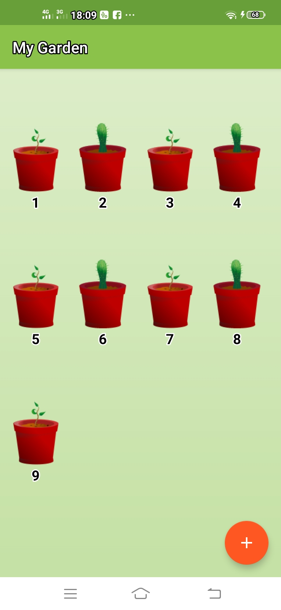
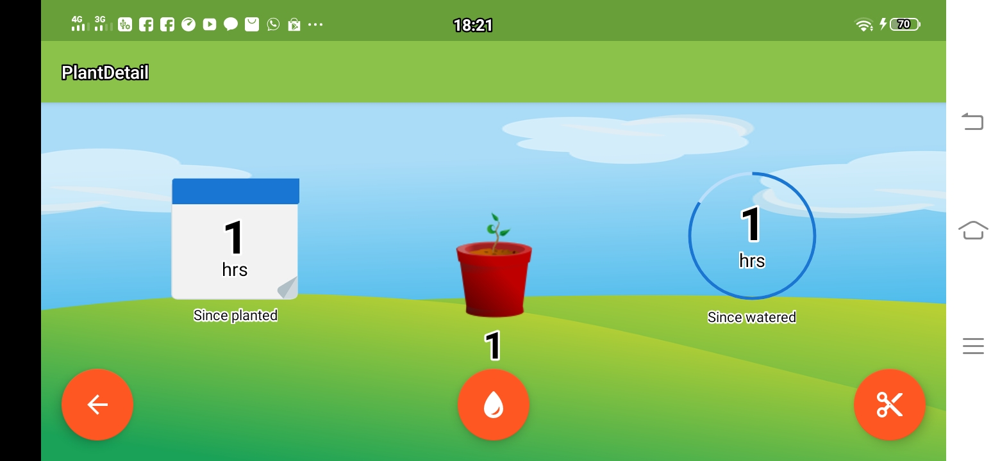

# 𝙐𝙍𝙂𝙀𝙉𝙏!!
>𝘗𝘳𝘰𝘫𝘦𝘤𝘵 𝘪𝘯𝘪 𝘮𝘦𝘳𝘶𝘱𝘢𝘬𝘢𝘯 𝘩𝘢𝘴𝘪𝘭 𝘱𝘦𝘮𝘣𝘦𝘭𝘢𝘫𝘢𝘳𝘢𝘯 𝘥𝘢𝘳𝘪 𝘶𝘥𝘢𝘤𝘪𝘵𝘺.𝘤𝘰𝘮 𝘱𝘢𝘥𝘢 𝘣𝘢𝘨𝘪𝘢𝘯 𝘸𝘪𝘥𝘨𝘦𝘵. 
𝘕𝘢𝘮𝘶𝘯, 𝘤𝘰𝘥𝘦 𝘱𝘢𝘥𝘢 𝘶𝘥𝘢𝘤𝘪𝘵𝘺 𝘴𝘶𝘥𝘢𝘩 𝘣𝘢𝘯𝘺𝘢𝘬 𝘺𝘢𝘯𝘨 𝘩𝘢𝘳𝘶𝘴 𝘥𝘪𝘳𝘦𝘷𝘪𝘴𝘪, 𝘫𝘢𝘥𝘪 𝘱𝘳𝘰𝘫𝘦𝘤𝘵 𝘥𝘪 𝘢𝘵𝘢𝘴 𝘴𝘶𝘥𝘢𝘩 𝘩𝘢𝘴𝘪𝘭 𝘳𝘦𝘷𝘪𝘴𝘪 𝘥𝘢𝘳𝘪 𝘤𝘰𝘥𝘦 𝘶𝘥𝘢𝘤𝘪𝘵𝘺 𝘺𝘢𝘯𝘨 𝘴𝘶𝘥𝘢𝘩 𝘭𝘢𝘮𝘢.
𝘉𝘦𝘳𝘪𝘬𝘶𝘵 𝘷𝘪𝘥𝘦𝘰 𝘮𝘢𝘵𝘦𝘳𝘪 𝘸𝘪𝘨𝘦𝘵 𝘥𝘪 𝘶𝘥𝘢𝘤𝘪𝘵𝘺: [𝘽𝙚𝙡𝙖𝙟𝙖𝙧 𝙒𝙞𝙙𝙜𝙚𝙩 𝙙𝙞 𝙐𝙙𝙖𝙘𝙞𝙩𝙮](https://classroom.udacity.com/courses/ud855/lessons/f133dd92-8e3c-40b9-9d9d-545498638459/concepts/cc786bc3-9fae-4ac2-9760-7269368b8787)

# 𝙔𝙪𝙠𝙨 𝙗𝙚𝙡𝙖𝙟𝙖𝙧 𝙩𝙚𝙣𝙩𝙖𝙣𝙜 𝙒𝙄𝘿𝙂𝙀𝙏 !
🆆🅸🅳🅶🅴🆃 𝘢𝘥𝘢𝘭𝘢𝘩 𝘢𝘴𝘱𝘦𝘬 𝘱𝘦𝘯𝘵𝘪𝘯𝘨 𝘥𝘢𝘳𝘪 𝘬𝘶𝘴𝘵𝘰𝘮𝘪𝘴𝘢𝘴𝘪 𝘭𝘢𝘺𝘢𝘳 𝘢𝘸𝘢𝘭. 𝘈𝘯𝘥𝘢 𝘥𝘢𝘱𝘢𝘵 𝘮𝘦𝘮𝘣𝘢𝘺𝘢𝘯𝘨𝘬𝘢𝘯𝘯𝘺𝘢 𝘴𝘦𝘣𝘢𝘨𝘢𝘪 𝘵𝘢𝘮𝘱𝘪𝘭𝘢𝘯 "𝘴𝘦𝘬𝘪𝘭𝘢𝘴" 𝘥𝘢𝘳𝘪 𝘥𝘢𝘵𝘢 𝘥𝘢𝘯 𝘧𝘶𝘯𝘨𝘴𝘪𝘰𝘯𝘢𝘭𝘪𝘵𝘢𝘴 𝘢𝘱𝘭𝘪𝘬𝘢𝘴𝘪 𝘺𝘢𝘯𝘨 𝘱𝘢𝘭𝘪𝘯𝘨 𝘱𝘦𝘯𝘵𝘪𝘯𝘨 𝘺𝘢𝘯𝘨 𝘥𝘢𝘱𝘢𝘵 𝘥𝘪𝘢𝘬𝘴𝘦𝘴 𝘭𝘢𝘯𝘨𝘴𝘶𝘯𝘨 𝘥𝘢𝘳𝘪 𝘭𝘢𝘺𝘢𝘳 𝘢𝘸𝘢𝘭 𝘱𝘦𝘯𝘨𝘨𝘶𝘯𝘢. 𝘗𝘦𝘯𝘨𝘨𝘶𝘯𝘢 𝘥𝘢𝘱𝘢𝘵 𝘮𝘦𝘮𝘪𝘯𝘥𝘢𝘩𝘬𝘢𝘯 𝘸𝘪𝘥𝘨𝘦𝘵 𝘥𝘪 𝘱𝘢𝘯𝘦𝘭 𝘭𝘢𝘺𝘢𝘳 𝘢𝘸𝘢𝘭 𝘮𝘦𝘳𝘦𝘬𝘢, 𝘥𝘢𝘯, 𝘫𝘪𝘬𝘢 𝘥𝘪𝘥𝘶𝘬𝘶𝘯𝘨, 𝘮𝘦𝘯𝘨𝘶𝘣𝘢𝘩 𝘶𝘬𝘶𝘳𝘢𝘯𝘯𝘺𝘢 𝘶𝘯𝘵𝘶𝘬 𝘮𝘦𝘯𝘺𝘦𝘴𝘶𝘢𝘪𝘬𝘢𝘯 𝘫𝘶𝘮𝘭𝘢𝘩 𝘪𝘯𝘧𝘰𝘳𝘮𝘢𝘴𝘪 𝘥𝘢𝘭𝘢𝘮 𝘸𝘪𝘥𝘨𝘦𝘵 𝘴𝘦𝘴𝘶𝘢𝘪 𝘱𝘳𝘦𝘧𝘦𝘳𝘦𝘯𝘴𝘪 𝘮𝘦𝘳𝘦𝘬𝘢.
𝙄𝙣𝙜𝙞𝙣 𝙢𝙚𝙣𝙜𝙚𝙣𝙖𝙡 𝙡𝙚𝙗𝙞𝙝 𝙙𝙖𝙡𝙖𝙢 𝙢𝙚𝙣𝙜𝙚𝙣𝙖𝙞 𝙒𝙄𝘿𝙂𝙀𝙏?
[𝙋𝙚𝙡𝙖𝙟𝙖𝙧𝙞 𝙩𝙚𝙣𝙩𝙖𝙣𝙜 𝙒𝙞𝙙𝙜𝙚𝙩](https://developer.android.com/guide/topics/appwidgets/overview)

# 𝙈𝙮𝙂𝙖𝙧𝙙𝙚𝙣 𝙒𝙄𝘿𝙂𝙀𝙏 
# 𝙏𝙖𝙢𝙥𝙞𝙡𝙖𝙣 𝘼𝙬𝙖𝙡 
>𝘚𝘦𝘵𝘦𝘭𝘢𝘩 𝘬𝘪𝘵𝘢 𝘳𝘶𝘯 𝘈𝘯𝘥𝘳𝘰𝘪𝘥 𝘚𝘵𝘶𝘥𝘪𝘰 𝘬𝘦𝘮𝘶𝘥𝘪𝘢𝘯 𝘢𝘬𝘢𝘯 𝘵𝘦𝘳𝘪𝘯𝘴𝘵𝘢𝘭 𝘱𝘢𝘥𝘢 𝘦𝘮𝘶𝘭𝘢𝘵𝘰𝘳 𝘢𝘱𝘭𝘪𝘬𝘢𝘴𝘪𝘯𝘺𝘢 𝘥𝘢𝘯 𝘢𝘬𝘢𝘯 𝘮𝘶𝘯𝘤𝘶𝘭 𝘴𝘦𝘱𝘦𝘳𝘵𝘪 𝘣𝘦𝘳𝘪𝘬𝘶𝘵, 𝘵𝘦𝘵𝘢𝘱𝘪 𝘣𝘦𝘭𝘶𝘮 𝘢𝘥𝘢 𝘵𝘢𝘯𝘢𝘮𝘢𝘯 𝘺𝘢𝘯𝘨 𝘵𝘦𝘳𝘵𝘢𝘮𝘣𝘢𝘩𝘬𝘢𝘯. 𝘜𝘯𝘵𝘶𝘬 𝘮𝘦𝘯𝘢𝘮𝘣𝘢𝘩𝘬𝘢𝘯 𝘵𝘢𝘯𝘢𝘮𝘢𝘯 𝘬𝘪𝘵𝘢 𝘣𝘪𝘴𝘢 𝘬𝘭𝘪𝘬 **𝘉𝘶𝘵𝘵𝘰𝘯 +** 𝘬𝘦𝘮𝘶𝘥𝘪𝘢𝘯 𝘢𝘬𝘢𝘯 𝘮𝘢𝘴𝘶𝘬 𝘬𝘦 𝘩𝘢𝘭𝘢𝘮𝘢𝘯 𝘣𝘦𝘳𝘪𝘬𝘶𝘵𝘯𝘺𝘢. 
# _____________________________________________________________________________

# 𝙃𝙖𝙡𝙖𝙢𝙖𝙣 𝙢𝙚𝙣𝙖𝙢𝙗𝙖𝙝𝙠𝙖𝙣 𝙩𝙖𝙣𝙖𝙢𝙖𝙣
>𝘜𝘯𝘵𝘶𝘬 𝘮𝘦𝘯𝘢𝘮𝘣𝘢𝘩𝘬𝘢𝘯 𝘵𝘢𝘯𝘢𝘮𝘢𝘯 𝘵𝘦𝘳𝘥𝘢𝘱𝘢𝘵 2 𝘰𝘱𝘴𝘪 𝘱𝘪𝘭𝘪𝘩𝘢𝘯 𝘺𝘢𝘪𝘵𝘶 𝘷𝘪𝘯𝘦 𝘥𝘢𝘯 𝘤𝘢𝘤𝘵𝘶𝘴. 𝘒𝘪𝘵𝘢 𝘥𝘢𝘱𝘢𝘵 𝘮𝘦𝘮𝘪𝘭𝘪𝘩 𝘥𝘦𝘯𝘨𝘢𝘯 𝘤𝘢𝘳𝘢 𝘮𝘦𝘯𝘨𝘬𝘭𝘪𝘬 𝘴𝘢𝘭𝘢𝘩 𝘴𝘢𝘵𝘶 𝘥𝘪 𝘢𝘯𝘵𝘢𝘳𝘢 𝘬𝘦𝘥𝘶𝘢𝘯𝘺𝘢. 𝘕𝘢𝘯𝘵𝘪𝘯𝘺𝘢 𝘵𝘢𝘯𝘢𝘮𝘢𝘯 𝘺𝘢𝘯𝘨 𝘬𝘪𝘵𝘢 𝘵𝘢𝘮𝘣𝘢𝘩𝘬𝘢𝘯 𝘢𝘬𝘢𝘯 𝘮𝘶𝘯𝘤𝘶𝘭 𝘱𝘢𝘥𝘢 𝘩𝘢𝘭𝘢𝘮𝘢𝘯 𝘢𝘸𝘢𝘭 𝘵𝘢𝘥𝘪.
# _____________________________________________________________________________

# 𝙃𝙖𝙡𝙖𝙢𝙖𝙣 𝙥𝙧𝙤𝙜𝙧𝙚𝙨𝙨 𝙩𝙖𝙣𝙖𝙢𝙖𝙣
>𝘗𝘢𝘥𝘢 𝘩𝘢𝘭𝘢𝘮𝘢𝘯 𝘪𝘯𝘪 𝘢𝘬𝘢𝘯 𝘵𝘦𝘳𝘥𝘢𝘱𝘢𝘵 𝘱𝘳𝘰𝘨𝘳𝘦𝘴𝘴 𝘥𝘢𝘳𝘪 𝘵𝘢𝘯𝘢𝘮𝘢𝘯 𝘺𝘢𝘯𝘨 𝘬𝘪𝘵𝘢 𝘱𝘪𝘭𝘪𝘩 𝘥𝘢𝘳𝘪 𝘮𝘦𝘮𝘪𝘭𝘪𝘩 𝘴𝘢𝘭𝘢𝘩 𝘴𝘢𝘵𝘶 𝘵𝘢𝘯𝘢𝘮𝘢𝘯 𝘺𝘢𝘯𝘨 𝘬𝘪𝘵𝘢 𝘵𝘢𝘮𝘣𝘢𝘩𝘬𝘢𝘯 𝘱𝘢𝘥𝘢 𝘩𝘢𝘭𝘢𝘮𝘢𝘯 𝘢𝘸𝘢𝘭. 𝘗𝘢𝘥𝘢 𝘵𝘢𝘮𝘱𝘪𝘭𝘢𝘯 𝘵𝘦𝘳𝘴𝘦𝘣𝘶𝘵 𝘵𝘦𝘳𝘥𝘢𝘱𝘢𝘵 𝘸𝘢𝘬𝘵𝘶 𝘺𝘢𝘯𝘨 𝘵𝘦𝘳𝘶𝘴 𝘣𝘦𝘳𝘫𝘢𝘭𝘢𝘯, 𝘣𝘢𝘪𝘬 𝘮𝘶𝘭𝘢𝘪 𝘸𝘢𝘬𝘵𝘶 𝘮𝘦𝘯𝘢𝘯𝘢𝘮 𝘮𝘢𝘶𝘱𝘶𝘯 𝘮𝘦𝘯𝘺𝘪𝘳𝘢𝘮. 𝘉𝘦𝘳𝘪𝘬𝘶𝘵 𝘮𝘦𝘳𝘶𝘱𝘢𝘬𝘢𝘯 𝘵𝘢𝘮𝘱𝘪𝘭𝘢𝘯 𝘭𝘢𝘯𝘥𝘴𝘤𝘢𝘱𝘦 𝘮𝘢𝘶𝘱𝘶𝘯 𝘱𝘰𝘵𝘳𝘢𝘪𝘵 𝘥𝘢𝘳𝘪 𝘩𝘢𝘭𝘢𝘮𝘢𝘯 𝘪𝘯𝘪.
# _____________________________________________________________________________

# 𝘽𝙖𝙜𝙖𝙞𝙢𝙖𝙣𝙖 𝙘𝙖𝙧𝙖 𝙢𝙚𝙣𝙖𝙢𝙗𝙖𝙝𝙠𝙖𝙣 𝙬𝙞𝙙𝙜𝙚𝙩 𝙙𝙞 𝘿𝙚𝙫𝙞𝙘𝙚?
>𝘊𝘢𝘳𝘢 𝘮𝘦𝘯𝘢𝘮𝘣𝘢𝘩𝘬𝘢𝘯 𝘸𝘪𝘥𝘨𝘦𝘵 𝘺𝘢𝘪𝘵𝘶 𝘱𝘦𝘳𝘵𝘢𝘮𝘢 𝘵𝘦𝘬𝘢𝘯 𝘭𝘢𝘺𝘢𝘳 𝘋𝘦𝘷𝘪𝘤𝘦 𝘬𝘦𝘮𝘶𝘥𝘪𝘢𝘯 𝘱𝘪𝘭𝘪𝘩𝘭𝘢𝘩 𝘸𝘪𝘥𝘨𝘦𝘵 𝘭𝘢𝘭𝘶 𝘢𝘬𝘢𝘯 𝘮𝘶𝘯𝘤𝘶𝘭 𝘣𝘦𝘣𝘦𝘳𝘢𝘱𝘢 𝘱𝘪𝘭𝘪𝘩𝘢𝘯 𝘸𝘪𝘥𝘨𝘦𝘵. 𝘜𝘯𝘵𝘶𝘬 𝘸𝘪𝘥𝘨𝘦𝘵 𝘺𝘢𝘯𝘨 𝘴𝘢𝘺𝘢 𝘣𝘶𝘢𝘵 𝘪𝘯𝘪 𝘮𝘦𝘯𝘨𝘨𝘶𝘯𝘢𝘬𝘢𝘯 𝘴𝘪𝘮𝘣𝘰𝘭 𝘴𝘦𝘱𝘦𝘳𝘵𝘪 𝘨𝘢𝘮𝘣𝘢𝘳 𝘣𝘦𝘳𝘪𝘬𝘶𝘵. 𝘒𝘦𝘮𝘶𝘥𝘪𝘢𝘯 𝘬𝘪𝘵𝘢 𝘬𝘭𝘪𝘬 𝘥𝘢𝘯 𝘣𝘪𝘴𝘢 𝘥𝘪𝘴𝘦𝘳𝘦𝘵 𝘬𝘦 𝘵𝘦𝘮𝘱𝘢𝘵 𝘺𝘢𝘯𝘨 𝘪𝘯𝘨𝘪𝘯 𝘬𝘪𝘵𝘢 𝘭𝘦𝘵𝘢𝘬𝘬𝘢𝘯.
# _____________________________________________________________________________

>**𝘉𝘦𝘳𝘪𝘬𝘶𝘵 𝘛𝘢𝘮𝘱𝘪𝘭𝘢𝘯 𝘢𝘱𝘢𝘣𝘪𝘭𝘢 𝘣𝘢𝘳𝘶 𝘮𝘦𝘯𝘢𝘮𝘣𝘢𝘩𝘬𝘢𝘯 𝘵𝘢𝘯𝘢𝘮𝘢𝘯**
# _____________________________________________________________________________

>**𝘉𝘦𝘳𝘪𝘬𝘶𝘵 𝘛𝘢𝘮𝘱𝘪𝘭𝘢𝘯 𝘴𝘦𝘵𝘦𝘭𝘢𝘩 1 𝘫𝘢𝘮 𝘮𝘦𝘯𝘢𝘮𝘣𝘢𝘩𝘬𝘢𝘯 𝘵𝘢𝘯𝘢𝘮𝘢𝘯**
# _____________________________________________________________________________
 

# 𝙉𝙊𝙏𝙀𝘿
- 𝘈𝘱𝘢𝘣𝘪𝘭𝘢 𝘢𝘯𝘥𝘢 𝘮𝘦𝘯𝘨𝘪𝘬𝘶𝘵𝘪 𝘱𝘳𝘰𝘴𝘦𝘴 𝘷𝘪𝘥𝘦𝘰 𝘶𝘥𝘢𝘤𝘪𝘵𝘺, 𝘢𝘯𝘥𝘢 𝘥𝘢𝘱𝘢𝘵 𝘮𝘦𝘮𝘱𝘦𝘳𝘣𝘢𝘪𝘬𝘪 𝘱𝘳𝘰𝘫𝘦𝘤𝘵 𝘴𝘦𝘴𝘶𝘢𝘪 𝘣𝘦𝘳𝘪𝘬𝘶𝘵 [𝘽𝙪𝙠𝙖 𝙍𝙚𝙫𝙞𝙨𝙞](https://github.com/udacity/AdvancedAndroid_MyGarden/pull/21/files)
𝘴𝘦𝘵𝘦𝘭𝘢𝘩 𝘮𝘦𝘳𝘦𝘷𝘪𝘴𝘪 𝘴𝘦𝘮𝘶𝘢, 𝘬𝘪𝘵𝘢 𝘢𝘬𝘢𝘯 𝘥𝘪𝘢𝘳𝘢𝘩𝘬𝘢𝘯 𝘶𝘯𝘵𝘶𝘬 𝘴𝘺𝘯𝘤 𝘵𝘦𝘳𝘩𝘢𝘥𝘢𝘱 𝘨𝘳𝘢𝘥𝘭𝘦 𝘣𝘶𝘪𝘭𝘥 𝘯𝘺𝘢.

